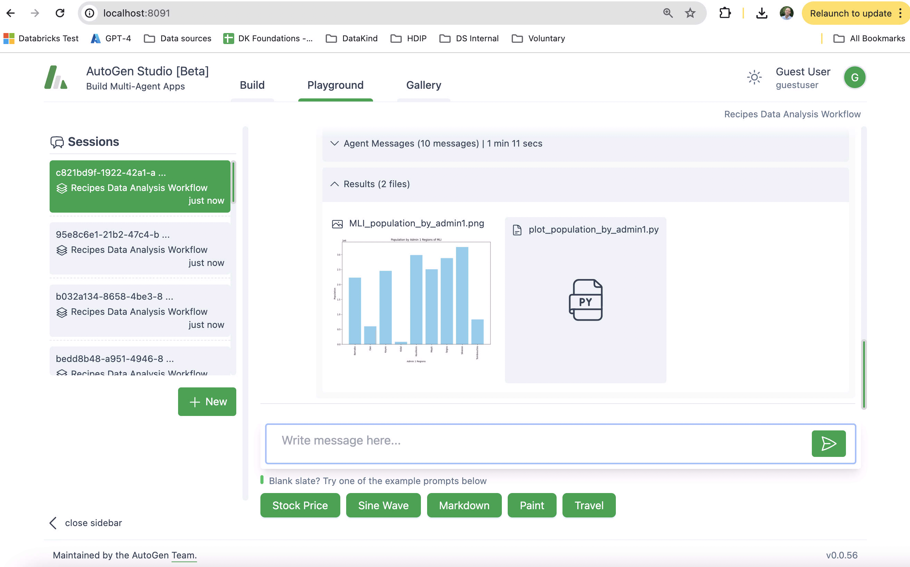

# Data Recipes AI

:warning: *This repo is being actively developed and is in a pre-release mode. Expect lots of changes and updates!*

Data recipes AI is a Large Language Model-powered platform for creating a library of data analysis 'Recipes' people can use in a chat interface ... 


By building a library, certain risks of using LLMs are reduced because data recipes will give exactly the same result every time and can be reviewed to ensure the answer is right. It's a way of using the awesome power of LLMs in a safer and more cost effective way. Based on [Large Language Models as Tool makers (LATM)](https://arxiv.org/abs/2305.17126), data recipes ai extends this to include memory management as well as human-in-the-loop review. 

For more information on the recipes concept, please see see [here](https://towardsdatascience.com/reframing-llm-chat-with-data-introducing-llm-assisted-data-recipes-f4096ac8c44b?source=friends_link&sk=eff68c95c51719977122a9baa6398752).

- [Demo video](https://www.loom.com/share/e27ae40a73e9470597e2d58176ecc4b9?sid=8421a557-fbdd-47f2-85eb-4e96da96b55f) showing AI-assisted coding for managing recipes
- [Demo video](https://www.loom.com/share/bd63433f977c4f21b2b7d44e7305473f?sid=9ad945ef-cbbd-469d-b4b5-dc8c6859fd75) showing end-user prototype

# Design Concepts

Data recipes have two types: (i) Exact memories, eg '*What is the population of Mali?*' which can be served directly to the user when they ask this question; (ii) Generic skills which can be run when requested for a scenario not in memory, eg a skill for 'What is the population of country X?' which can be called when the user asks something like '*What is the population of Nigeria?*'. In both cases the match to the user's intent is made using semantic search with LLM-reranking.

Given the rapidly changing landscape of LLMs, we have tried as much as possible to implement data recipes in such a way that it can be integrated with various semantic architectures and frameworks. By implementing recipes using a recipes server (powered by FastAPI), it can be called from [Open AI assistant](https://platform.openai.com/docs/assistants/overview) actions and [Copilot Studio](https://www.microsoft.com/en-us/microsoft-copilot/microsoft-copilot-studio) as well from any custom code. Also included in this repo is an example of using recipes via OpenAI format plugins, as supported by frameworks such as [semantic kernel](https://learn.microsoft.com/en-us/semantic-kernel/overview/?tabs=Csharp). 

Data recipes supports datasources accessed via API, but in some cases it is preferable to ingest data in order to leverage LLM SQL capabilities. We include an initial set of data sources specific to humanitarian response in the ingestion module, which can be extended to include additional sources as required.

Finally, we provide a sync process that will allow recipe managers to check out and work on recipes locally, then publish them back into the recipes database for wider consumption. We also provide a autogen studio setup enabling the recipe managers to use experimental assistants to generate and run recipes, semi-automating the process. We are not developing a dedicated user interface because most developers and data scientists would prefer to use their existing development environment (such as VS Code + GitHub Copilot) for reviewing, updating, and creating new recipes.

Some more discussion on design decisions can also be found [here](https://www.loom.com/share/500e960fd91c44c282076be4b0126461?sid=83af2d6c-622c-4bda-b21b-8f528d6eafba).

# What's in this repo?


This repo contains a docker-compose environment that will run the following components:

- A [Chainlit](https://docs.chainlit.io/get-started/overview) chat app
- A Data Recipes AI server 
- Data ingestion pipeline, with simple configuration that can add new sources if they have an 'openapi.json' file 
- Postgres Databases for storing recipes and data with extensions for [PGVector](https://github.com/pgvector/pgvector) (for vector search) and [Postgis](https://postgis.net/) (for supporting the storage of Geospatial Shape files)
- A recipes command line interface (CLI) for people approving/improving/creating recipes using the favorite IDE (eg VS Code + GitHub Copilot)
- (Azure) Open AI Assistant creation tools to create assistants that are aware of the data sources available in the data recipes ai environment 
- Autogen studio agent team for helping creating recipes [ In progress ]

# Quick start

1. Install Docker if you don't have it already, see [here](https://www.docker.com/products/docker-desktop/)
2. Check out the Data Recipes AI GitHub repo

    Go to the [repo](https://github.com/datakind/data-recipes-ai) in Github, and click the big green '<> Code' button. This provides a few options, you can download a zip file, or check the code out with git. If you have Git installed, a common method would be ...

    `git clone https://github.com/datakind/data-recipes-ai.git`

3. Populate your `.env` file with important settings to get started

    First, copy `.env.example` in your repo to `.env` in the same location, then adjust the following valriables.

    If using **Azure OpenAI**, you will need to set these in your `.env` ...

    ```
    RECIPES_OPENAI_API_TYPE=azure
    RECIPES_OPENAI_API_KEY=<The API key>
    RECIPES_OPENAI_API_ENDPOINT=<eg https://<YOUR DEPLOYMENT NAME>.openai.azure.com/>
    RECIPES_OPENAI_API_VERSION=<The API version in your deployment, eg 2024-05-01-preview>
    RECIPES_MODEL=<The deployment name you created in Azure, eg gpt-4o>

    ASSISTANTS_API_TYPE=azure  
    ASSISTANTS_API_KEY=<API Key as found on the Azure OpenAI resource>
    ASSISTANTS_ID=<ID of the assistant you created in OpenAI. Leave blank if you do not have one yet>
    ASSISTANTS_BASE_URL=<eg https://<YOUR DEPLOYMENT NAME>.openai.azure.com/>
    ASSISTANTS_API_VERSION=<The API version in your deployment, eg 2024-05-01-preview>
    ASSISTANTS_MODEL=<The deployment name of the model you created in Azure which the assitant uses, eg gpt-4o>
    ASSISTANTS_BOT_NAME=<Your assistant name, eg "Humanitarian AI Assistant">

    ```

    Note: In Azure Playground, you can view code for your assistant which provide most of the variables above

    If using **OpenAI directly***, you will instead need to set these ...

    ```
    RECIPES_OPENAI_API_TYPE=openai
    RECIPES_OPENAI_API_KEY=<The API key you created on OpenAI>
    RECIPES_MODEL=<model name, we recommend gpt-4o>
    RECIPES_OPENAI_TEXT_COMPLETION_DEPLOYMENT_NAME=text-embedding-ada-002

    ASSISTANTS_API_TYPE=openai 
    OPENAI_API_KEY=<The API key you created on OpenAI>
    ASSISTANTS_API_KEY=${OPENAI_API_KEY}
    ASSISTANTS_ID=<ID of the assistant you created in OpenAI. Leave blank if you do not have one yet>
    ASSISTANTS_MODEL=<The model your assistant uses>
    ASSISTANTS_BOT_NAME=<Your assistant name, eg "Humanitarian AI Assistant">
    ```

    Be aware that lower-power models such as GPT-3.5-Turbo can serve recipes and carry out basic chat, but perform poorly for analysis and code generation.

    Not needed for quick start, but if you want to run ingestion of data with the new HDX API, then you will need to set ...

    `HAPI_API_TOKEN=<See https://hdx-hapi.readthedocs.io/en/latest/getting-started/>`

4. Download sample Humanitarian Data Exchange (HDX) API data

    For a quick start, we have prepared a sample dataset extracted from the new [HDX API](https://hdx-hapi.readthedocs.io/en/latest/). You can also run the ingestion yourself (see below), but this demo file should get you started quickly.

    From [this Google folder](https://drive.google.com/drive/folders/1E4G9HM-QzxdXVNkgP3fQXsuNcABWzdus?usp=sharing), download the file starting with 'datadb' and save it into the 'data' folder of your repo.

    Note: If you use python, you can also download this file by running this in your checked out repo top directory `pip3 install gdown && cd data && python3 download_demo_data.py && cd ..`

5. Start your environment

    `docker compose up -d --build`

6. If you don't have one already, create an AI Assistant on Open AI (or Azure OpenAI)

    Data Recipes AI uses Open AI style assistants, which support running code, and searching user-supplied data. We have provided a script to automatically do everything for you. 

    In a terminal, navigate to the repo top folder and run `docker compose exec chat python create_update_assistant.py`

    Make note of the assitant ID, then edit your `.env` file and using it set variable `ASSISTANTS_ID`.

    Note: (i) If you rerun `create_update_assistant.py` once `ASSISTANTS_ID` is set, the script will update the assistant rather than create a new one. You will need to do this if trying different models; (ii) You can also add your own data, pdf, docx, csv, xlsx files for the assistant to use, see section 'Adding your own files for the assistant to analyze' below.

7. Restart so the assistant ID is set, `docker compose up -d`

8. Go to [http://localhost:8000/](http://localhost:8000/) and sign-in using the values in your `.env` file for `USER_LOGIN` and `USER_PASSWORD`

## Stoping/Starting the environment

The steps above are mostly one-time. Going forward you only need to stop and start the environment as follows:

- To stop the environment `docker compose stop`
- To start the environment `docker compose up -d`, then go to [http://localhost:8000/](http://localhost:8000/)
- To start with rebuild `docker compose up -d --build` (for more details about development, see [CONTRIBUTION](CONTRIBUTION.md))

## Using Recipes

We are in a phase of research to identify and improve recipes, but for now the system comes with some basic examples to illustrate. To find out the list, enter "Get all recipes" in the chat interface.

## Additional Features 

### Adding your own files for the assistant to analyze

The assistant can be configured to analyze your own files, either in searching them or using them when analyzing data on-the-fly. To add your own files, place them in one of the following folders:

`./assistants/chat_ui/files/file_search/custom` : The assistant will search these files
`./assistants/chat_ui/files/code_interpreter/custom` : The assistant can use these files when generating and running code

Once you have put your files in the above folders, you can update your assistant by running ...

`docker compose exec chat python create_update_assistant.py`

### Analysis on Ingested Data 

By default, the repo comes with some demo HAPI data. To run the ingestion module for ingested datasets yourself ...

`docker compose exec ingestion python ingest.py`

It may take a while!

Note: By default, rerunning the ingestion will not download data if the file already exists locally. To override this, you can run with ...

`docker compose exec ingestion python ingest.py --force_download`

### Analysis on Uploaded files

As mentioned below, it is possible to add files the assistant can use on its creation. These can be used for all chats.

Additionally, you can upload CSV, Excel files for LLM-poweered analysis, as well as documents. Please note though, this is LLM analysis rather than recipes and the results should be treated with caution. 


#### Running ingestion without running full environment

If you want to *just* download data and not run the full environment, this is possible as follows:

First setup conda environment ...

1. Install [miniconda](https://docs.conda.io/en/latest/miniconda.html) by selecting the installer that fits your OS version. Once it is installed you may have to restart your terminal (closing your terminal and opening again)
2. Open terminal and `cd ingestion`
3. `conda env create -f environment.yml`
4. `conda activate data_recipes`

Then run ingestion in download only mode ...

5. `python ingest.py --skip_processing --skip_uploading`

#### Adding new data sources

To add new ingestion data sources, please refer to [CONTRIBUTION](CONTRIBUTION.md)

# Managing recipes

The management of recipes is part of the human in the loop approach of this repo. New recipes are created in status pending and only get marked as approved, once they have been verified by a recipe manager. Recipe managers can 'check out' recipes from the database into their local development environment such as VS Code to run, debug, and edit the recipes, before checking them back in. To make this process platform independent, recipes are checked out into a docker container, which can be used as the runtime environment to run the recipes via VSCode. 

Recipes are managed using the recipes Command Line Interface (CLI), which allows you to check out recipes, run and refine with LLM assistance, then commit them back to the recipes database for use in data recipes AI.

To run the CLI, you will need to start the docker environment as described in the 'Quick Start', then

`docker compose exec -it manager python cli.py`

When you first log in, you will be asked for your name. This is used when checking in recipes. Once in, you will be presented with a menu like this ...

```

Welcome to the recipes management CLI, matt!

    Here are the commands you can run:

       'checkout': Check out recipes for you to work on
       'list': List all recipes that are checked out
       'run': Run a recipe, you'll be prompted, or use 'run 5' to run 5.
       'add': Add a new recipe (using LLM)
       'edit': Edit a recipe (using LLM). You'll be prompted, or use 'edit 5' to edit 5.
       'delete': Delete a recipe, you will be prompted to choose which one
       'checkin': Check in recipes you have completed
       'makemem': Create a memory using recipe sample output
       'rebuild': Removes database data, runs all local recipes and checks them in
       'dumpdb': Dump embedding, recipe and memory tables to DB upgrade files so included in build
       'help': Show a list of commands
       'quit': Exit this recipes CLI

    Chat with Data Mode:

       'chat': Enter data chat mode to ask questions about the data

    Type one of the commands above to do some stuff.


>> 
```

The first thing you will want to do is run 'checkout' to get all the recipe code from the database onto your computer so you can run them. Once you have them locally, you can edit them in tools like Visual Studio code. They will appear in folder './management/work'.

To run recipes locally you can use the CLI 'run' command. This will run the recipe in the same environment, and will save the results like sample outputs, for you so they can be published back to the database.

You can create new recipes by entering 'add', where you'll be prompted for an intent. This will call an LLM to generate a first pass at your recipe, using the data that's in the data recipes environment.

When ready, you can check in your new and edited recipes with 'checkin'.

# Autogen Studio and autogen agent teams for creating data recipes



Data recipes AI contains an autogenstudio instance for the Docker build, as well as sample skill, agent and workflows to use a team of autogen agents for creating data recipes.

You can information on Autogen studio [here](https://github.com/microsoft/autogen/tree/main/samples/apps/autogen-studio). This folder includes a skill to query the data recipes data DB, an agent to use that, with some prompts to help it, and a workflow that uses the agent.

To activate:

1. Go to [http://localhost:8091/](http://localhost:8091/)
2. Click on 'Build'
3. Click 'Skills' on left, top right click '...' and import the skill in `./assistants/recipes_agents/autogen_team/`
4. Click 'Agents' on left, top right click '...' and import the agent in `assistants/recipes_agents/autogen_team/`
5. Click 'Workflows' on left, top right click '...' and import the workflow in `assistants/recipes_agents/autogen_team/`
6. Go to playground and start a new session, select the 'Recipes data Analysis' workflow
7. Ask 'What is the total population of Mali?'

