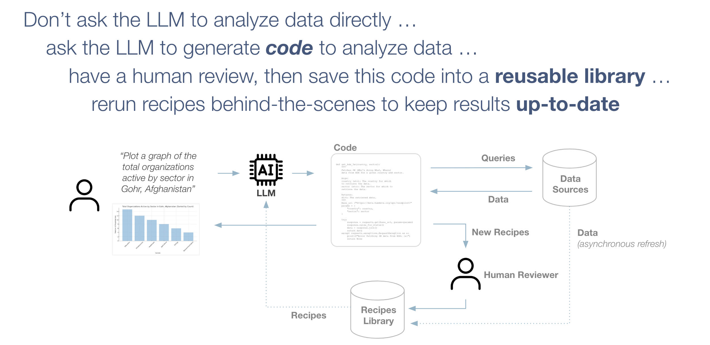
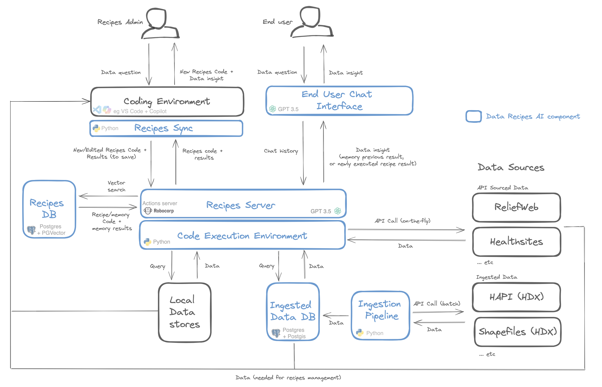

# Data Recipes AI

:warning: *This repo is being actively developed and is in a pre-release mode. Expect lots of changes and updates!*

Data recipes AI is a Large Language Model-powered platform for creating a library of data analysis 'Recipes' people can use in a chat interface ... 



By building a library, certain risks of using LLMs are reduced because data recipes will give exactly the same result every time and can be reviewed to ensure the answer is right. It's a way of using the awesome power of LLMs in a safer and more cost effective way. Based on [Large Language Models as Tool makers (LATM)](https://arxiv.org/abs/2305.17126), data recipes ai extends this to include memory management as well as human-in-the-loop review. 

For more information see [here](https://towardsdatascience.com/reframing-llm-chat-with-data-introducing-llm-assisted-data-recipes-f4096ac8c44b?source=friends_link&sk=eff68c95c51719977122a9baa6398752).

# Design Concepts

Data recipes have two types: (i) Exact memories, eg '*What is the population of Mali?*' which can be served directly to the user when they ask this question; (ii) Generic skills which can be run when requested for a scenario not in memory, eg a skill for 'What is the population of country X?' which can be called when the user asks something like '*What is the population of Nigeria?*'. In both cases the match to the user's intent is made using semantic search with LLM-reranking.

Given the rapidly changing landscape of LLMs, we have tried as much as possible to implement data recipes in such a way that it can be integrated with various semantic architectures and frameworks. By implementing recipes using a recipes server (powered by [Robocorps actions server](https://github.com/robocorp/robocorp#readme)), it can be called from [Open AI assistant](https://platform.openai.com/docs/assistants/overview) actions and [Copilot Studio](https://www.microsoft.com/en-us/microsoft-copilot/microsoft-copilot-studio) as well from any custom code. Also included in this repo is an example of using recipes via OpenAI format plugins, as supported by frameworks such as [semantic kernel](https://learn.microsoft.com/en-us/semantic-kernel/overview/?tabs=Csharp). 

Data recipes supports datasources accessed via API, but in some cases it is preferable to ingest data in order to leverage LLM SQL capabilities. We include an initial set of data sources specific to humanitarian response in the ingestion module, which can be extended to include additional sources as required.

Finally, we provide a sync process that will allow recipe managers to check out and work on recipes locally, then publish them back into the recipes database for wider consumption. We also provide a autogen studio setup enabling the recipe managers to use experimental assistants to generate and run recipes, semi-automating the process. We are not developing a dedicated user interface because most developers and data scientists would prefer to use their existing development environment (such as VS Code + GitHub Copilot) for reviewing, updating, and creating new recipes.

Some more discussion on design decisions can also be found [here](https://www.loom.com/share/500e960fd91c44c282076be4b0126461?sid=83af2d6c-622c-4bda-b21b-8f528d6eafba).

# What's in this repo?



This repo contains a docker-compose environment that will run the following components:

- A [LibreChat](https://docs.librechat.ai/) platform with configured examples of using data recipes in plugins or assistants 
- A Data Recipes AI server powered by [Robocorps actions server](https://github.com/robocorp/robocorp#readme) and a basic code execution environment to run recipes
- Data ingestion pipeline, with simple configuration that can add new sources if they have an 'openapi.json' file 
- Postgres Databases for storing recipes and data with extensions for [PGVector](https://github.com/pgvector/pgvector) (for vector search) and [Postgis](https://postgis.net/) (for supporting the storage of Geospatial Shape files)
- A recipes management environment for people approving/improving/creating recipes using the favorite IDE (eg VS Code + GitHub Copilot)
- (Azure) Open AI Assistant creation tools to create assistants that are aware of the data sources available in the data recipes ai environment 
- Autogen studio agent team for helping creating recipes [ In progress ]

# Quick start

The following sets you up with data recipes, as provided using the OpenAI plugin architecture. The plugin calls the recipe server, which extracts recipes and memories of data analysis tasks, and presents them back to the user.

## One-time Setup 

:warning: *This is very much a work in progress, much of the following will be automated*

You can find a video of the quick start [here](https://www.loom.com/share/9e63bc1efe244dc6ad52b29a698bc3af?sid=0204a95b-aae6-40b7-9ea1-46fbffbb09d5), running through the steps below.

First, start the environment ...

1. Copy `.env.example` to `.env` and set variables according to instructions in the file

The majority of variables in the `.env.example` can be left as they are. The key variables to set in order to get started quickly are:

HAPI_API_TOKEN - The new HDX API token, see .env.example for instructions
OPENAI_API_KEY - if you are using OpenAI
AZURE_API_KEY_ENV - If you are using Azure

Then the following ...

RECIPES_OPENAI_API_TYPE - one of 'azure' or 'openai' depending on which you are using
RECIPES_OPENAI_API_KEY  - The API key
RECIPES_OPENAI_API_ENDPOINT - If using Azure you will need to set this endpoint see .env.example for instructions

Later, you can configure keys for other models and assistant creation, but the above should get you started.


2. `docker compose up -d --build`

Then configure the chat platform ...

1. Go to  [chat app](http://localhost:3080/) and register a user on the login page
2. Select "Plugins" endpoint at top, then in the plugin box go to store and activate 
   - Humanitarian Data Assistant
   - Humanitarian Data Recipes
   - Code Sherpa, when asked enter URL http://code-interpreter:3333
3. Import the presets ...
   - In the top row of the chat window, there is a small icon with two squares, click it
   - Click the import button
   - Navigate to the preset files in './assistants/plugin_assistants' 
   - Import file 'IN_PROGRESS! Recipes Plugin.json'
   - Click the two squares icon again and select the preset

Note: If you reset your docker environment you will need to run the above steps again.

## Using Recipes

We are in a phase of research to identify and improve recipes, but for now the system comes with some basic examples to illustrate. To see these, try asking one of the following questions ...

- "*What is the hazard exposure risk for Mali?*"
- "*Retrieve full details for Tombouctou region*"
- "*Request a situation report for Mali*"
- "*plot bar chart for food insecurity by state in Cameroon*"
- "*plot bar chart for food insecurity by state in Cameroon*"
- "*plot population pyramids all on one page for Nigeria, Sudan, Chad, Niger*"
- "*Generate an administrative level 2 map of food security in Chad*"
- "*Plot a world map of overall risk by country with light gray outlines for all countries*"

The first time you run a recipe it will be slow as it spins up a process, but should be a bit faster thereafter. We are working on making this even faster in the coming months.

## Additional Features 

### Analysis on Ingested Data 

To run the ingestion module for ingested datasets, so assistants and plugins can analysis data on-the-fly as an experimental feature:

1. `docker exec -it haa-ingestion /bin/bash`
2. `python3 ingest.py`

It may take a while!

### Recipes in Open AI (or Azure OpenAI) assistants

The above will provide basic data recipes via the plugins architecture. If you want to also explore using Azure or Open AI assistants, the repo includes an approach where data files are uploaded to the assistant, and a prompt for it to analyse. 

1. Run the ingestion as mentioned above
2. Review the settings in `.env` that start with 'ASSISTANTS'
3. In directory `assistants/openai_assistants` run `create_update_assistant.py`, this will upload data files and create an assistant. See also prompts in sub-directory `templates`.
4. Under the 'Assistants' dialogue in http://localhost:3080/, choose your new assistantL
5. Under actions, create a new action and use the function definition from [here](http://localhost:4001/openapi.json). You'll need to remove the comments at the top and change the host to be 'url' in 'servers' to be "http://actions:8080"
6. Save the action
7. Update the agent

# To start the environment

To configure your environment the first time, see 'One Time Setup' below. Once done, anytime after that all you need is ...

1. `docker compose up`
2. Got to [chat app](http://localhost:3080/) 
3. Log in
4. Choose your preset and start chatting!

You can also access the recipe server monitoring endpoint (Robocorp actions server):

- Recipes server (Robocorp AI Actions): [http://localhost:4001/](http://localhost:4001/)
- Robocorp AI Actions API: [http://localhost:3001/](http://localhost:3001/)

## Resetting your environment

If running locally, you can reset your environment - removing any data for your databases, which means re-registration - by running `./cleanup.sh`.

# Development

## Testing connection to actions server

1. `docker exec -it haa-libre-chat  /bin/sh`
2. To test the SQL query action, run `curl -X POST -H "Content-Type: application/json"  -d '{"query": "select 1"}' "http://actions:8080/api/actions/postgresql-universal-actions/execute-query/run"`
3. To get get-memory action, run ... `curl -X POST -H "Content-Type: application/json"  -d '{"chat_history": "[]", "user_input":"population of Mali", "generate_intent":"true"}'  "http://actions:8080/api/actions/get-data-recipe-memory/get-memory/run"`

## LibreChat Plugins

With a defined set of functionalities, [plugins](https://docs.librechat.ai/features/plugins/introduction.html) act as tools for the LLM application to use and extend their capabilities.

To create an additional plugin, perform the following steps:

1. Create a new robocorp action in a new folder under [actions_plugins](./actions/actions_plugins/). You can reference the [recipe-server](./actions/actions_plugins/recipe-server/) action to see the relevant files, etc. 
2. Create OpenAPI specification to describe your endpoint. The openapi.json file of the robocorps actions (available on localhost:3001 when the containers are up and running) should contain all necessary information of the endpoint and can be easily converted into a openapi.yaml file. For local development, the open api spec file has to be added to the [openapi directory](./ui/recipes-chat/tools/.well-known/openapi/) and can then be referenced as the url in the manifest. You can use the [haa_datarecipes.yaml](./ui/recipes-chat/tools/.well-known/openapi/haa_datarecipes.yaml) as a template. Please note that robocorp expects inputs to the actions in the body of the API call. For the docker setup, the url can be set to http://actions:8080 as all containers are running in the same network, but this has to be adjusted for the production environment. 
3. Create plugin manigest to describe the plugin for the LLM to determine when and how to use it. You can use [haa_datarecipes.json](./ui/recipes-chat/tools/haa_datarecipes.json) as a template 

As the robocorp actions might differ slightly, this can lead to differing requirements in the openapi spec, and manifest files. The [LibraChat documentation](https://docs.librechat.ai/features/plugins/chatgpt_plugins_openapi.html) provides tips and examples to form the files correctly. 

## Managing recipes

The management of recipes is part of the human in the loop approach of this repo. New recipes are created in status pending and only get marked as approved, once they have been verified by a recipe manager. Recipe managers can 'check out' recipes from the database into their local development environment such as VS Code to run, debug, and edit the recipes, before checking them back in. To make this process platform independent, recipes are checked out into a docker container, which can be used as the runtime environment to run the recipes via VSCode. 

Recipes are managed using the recipes Command Line Interface (CLI), which allows you to check out recipes, run and refine, the commit them back to the recipes database for use in data recipes AI.

To run the cli, you will need to install some packages ...

`pip3 install typer`

Once this is done, and you have your docker environment running as  described above, you start the recipes CLI with ...

`python cli.py`

When you first log in, you will be asked for your name. This is used when checking in recipes. Once in, you will be presented with a menu like this ...

```

Welcome to the recipes management CLI, matt!

    Here are the commands you can run:
    
    'checkout': Check out recipes for you to work on
    'list': List all recipes that are checked out
    'run': Run a recipe, you will be prompted to choose which one
    'add': Add a new recipe
    'delete': Delete a recipe, you will be prompted to choose which one
    'checkin': Check in recipes you have completed
    'makemem': Create a memory using recipe sample output
    'help': Show a list of commands
    'quit': Exit this recipes CLI

    Type one of the commands above to do some stuff.


>> 
```

The first thing you will want to do is run 'checkout' to get all the recipe code from the database onto your computer so you can run them. Once you have them locally, you can edit them in tools like Visual Studio code. 

To run recipes locally you can use the CLI 'run' command. This will run the recipe in the same environment, and will save the results like sample outputs, for you so they can be published back to the database.

You can create new recipes by entering 'add', where you'll be prompted for an intent. This will call an LLM to generate a first pass at your recipe, using the data that's in the data recipes environment.

When ready, you can check in your new and edited recipes with 'checkin'.

### Other approaches

You can also configure VS Code to connect to the recipe-manage container for running recipes ...

1. Install the DevContainers VSCode extension 
2. Build data recipes using the `docker compose` command mentioned above
3. Open the command palette in VSCode (CMD + Shift + P on Mac; CTRL + Shift + P on Windows) and select 

   `Dev Containers: Attach to remote container`. 

   Select the recipe-manager container. This opens a new VSCode window - use it for the next steps.
4. Open folder `/app`
5. Navigate to your recipe in sub-folder `checked_out`
6. Run the `recipe.py` in a terminal or set up the docker interpretor

# Autogen Studio and autogen agent teams for creating data recipes


Data recipes AI contains an autogenstudio instance for the Docker build, as well as sample skill, agent and workflows to use a team of autogen agents for creating data recipes.

You can information on Autogen studio [here](https://github.com/microsoft/autogen/tree/main/samples/apps/autogen-studio). This folder includes a skill to query the data recipes data DB, an agent to use that, with some prompts to help it, and a workflow that uses the agent.

To activate:

1. Go to [http://localhost:8091/](http://localhost:8091/)
2. Click on 'Build'
3. Click 'Skills' on left, top right click '...' and import the skill in `./assets`
4. Click 'Agents' on left, top right click '...' and import the skill in `./assets`
5. Click 'Workflows' on left, top right click '...' and import the skill in `./assets`
6. Go to playground and start a new session, select the 'Recipes data Analysis' workflow
7. Ask 'What is the total population of Mali?'

# Deployment

We will add more details here soon, for now, here are some notes on Azure ...

## Deploying to Azure

A deployment script './deployment/deploy_azure.py' is provided to deploy to an Azure Multicontainer web app you have set up with [these instructions](https://learn.microsoft.com/en-us/azure/app-service/tutorial-multi-container-app). The script is run from the top directory. Note: This is for demo purposes only, as Multicontainer web app are still in Public Preview. 

To run the deployment ...

`python3 ./deployment/deploy_azure.py`

One thing to mention on an Azure deploy, it doesn't get pushed to the web app sometimes, until a user tries to access the web app's published URL. No idea why, but if your release is 'stuck', try this.

Note: 

- `./deployment/./deployment/docker-compose-azure.yml` is the configuration used in the deployment center screen on the web app
- `./deployment/./deployment/docker-compose-deploy.yml` is the configuration used when building the deployment
- `docker-compose.yml` is used for building locally

:warning: *This is very much a work in progress, deployment will be automated with fewer compose files soon*

You will need to set key environment variables, see your local `.env` for examples. The exceptions are the tokens needed for authentication, do not use the defaults for these. You can generate them on [this page](https://www.librechat.ai/toolkit/creds_generator).

## Databases

When running in Azure it is useful to use remote databases, at least for the mongodb instance so that user logins are retained with each release. For example, a databse can be configured by following [these instructions](https://docs.librechat.ai/install/configuration/mongodb.html). If doing this, then docker-compose-azure.yml in Azure can have the mongo DB section removed, and any instance of the Mongo URL used by other containers updated with the cloud connection string accordingly.
