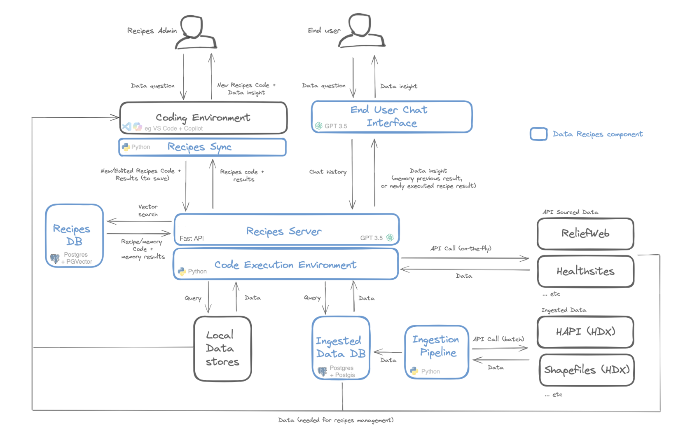

# Data Recipes AI

:warning: *This repo is being actively developed and is in a pre-release mode. Expect lots of changes and updates!*

Data recipes AI is a Large Language Model-powered platform for creating a library of data analysis 'Recipes' people can use in a chat interface ... 

By building a library, certain risks of using LLMs are reduced because data recipes will give exactly the same result every time and can be reviewed to ensure the answer is right. It's a way of using the awesome power of LLMs in a safer and more cost effective way. Based on [Large Language Models as Tool makers (LATM)](https://arxiv.org/abs/2305.17126), data recipes ai extends this to include memory management as well as human-in-the-loop review. 

# Design Concepts

Data recipes have two types: (i) Exact memories, eg 'What is the population of Mali?' which can be served directly to the user when they ask this question; (ii) Generic skills which can be run when requested for a scenario not in memory, eg a skill for 'What is the population of country X?' which can be called when the user asks something like 'What is the population of Nigeria?'. In both cases the match to the user's intent is made using sematic search with LLM-reranking.

Given the rapidly changing landscape of LLMs, we have tried as much as possible to implement data recipes in such as way that it can be intergrated with various semantic architectures and frameworks. By implementing recipes using a recipes server (powered by [Robocorps actions server](https://github.com/robocorp/robocorp#readme)), it can be called from [Open AI assistant](https://platform.openai.com/docs/assistants/overview) actions and [Copilot Studio](https://www.microsoft.com/en-us/microsoft-copilot/microsoft-copilot-studio) as well from any custom code. Also included in this repo is an example of using recipes via OpenAI format plugins, as supported by frameworks such as [semantic kernel](https://learn.microsoft.com/en-us/semantic-kernel/overview/?tabs=Csharp). 

Data recipes supports datasources accessed via API, but in some cases it is preferable to ingest data in order to leverage LLM SQL capabilities. We include an initial set of data sources specific to Humanitarian Response in the ingestion module, which can be extended to include additional sources as required.

Finally, for reviewing/updating/creating new recipes, though we provide some experimental assistants that can generate and run code, in talking with developers and datascientists, most would prefer to use their existing environment for development, such as VS Code + GitHub Copilot. For this reason we provide a sync process that will allow recipe managers to check out and work on recipes locally, then publish them back into the recipes database for wider consumption.

# What's in this repo?

This repo contains a docker-compose environment that will run the following components:

- A [LibreChat](https://docs.librechat.ai/) platform with configured examples of using data recipes in plugins or assistants 
- A Data Recipes AI server powered by [Robocorps actions server](https://github.com/robocorp/robocorp#readme) and a basic code execution environment run running recipes
- Data ingestion pipeline, with simple configuration that can add new sources if they have an 'openapi.json' file 
- Postgres Databases for storing recipes and data with extensions for [PGVector](https://github.com/pgvector/pgvector) (for vector search) and [Postgis](https://postgis.net/) (for supporting the storage of Geospatial Shape files)
- A recipes management environment for people approving/improving/creating recipes using the favorite IDE (eg VS Code + GitHub Copilot)
- (Azure) Open AI Assistant creation tools to create assistants that are aware of the data sources available in the data recipes ai environment 

# One-time Setup

:warning: *This is very much a work in progress, much of the following will be automated*

First, start the environment ...

1. Copy `.env.example` to `.env` and set variables according to instructions in the file
2. `docker compose down`
3. `docker compose pull`
4. `docker compose up`

Then configure the chat platform ...

1. Got to  [chat app](http://localhost:3080/) and register a user on the login page
2. Select "Plugins" endpoint at top, then in the plugin box go to store and activate 
   - Humanitariuan Data Assistant
   - Humanitarian Data Recipes
   - Code Sherpa, when asked enter URL http://code-interpretor:3333
3. Import the presets ...
   - In the top row of the chat window, there is a small icon with two squares, click it
   - Navigate to the preset files in './assistants/plugin_assistants' 
   - Import each file
4. Next ingest data ...
   - `docker exec -it haa-ingestion /bin/bash`
   - `python3 ingest.py`

Note: If you reset your docker environment you will need to run the above steps again.

The above will provide basic data recipes via the plugins architecture. If you want to also explore using Azure or Open AI assistants ...

5. Review the settings in `.env` that start with 'ASSISTANTS'
6. In directory `assistants/openai_assistants` run `create_update_assistant.py`, this will upload data files and create an assistant. See also prompts in sub-directory `templates`.
7. Under the 'Assistants' dialogue in http://localhost:3080/, choose your new assistantL
8. Under actions, create a new action and use the function definition from [here](http://localhost:4001/openapi.json). You'll need to remove the comments at the top and change the host to be 'url' in 'servers' to be "http://actions:8080"
9. Save the action
10. Update the agent

# To start the environment

To configure your environment the first time, see 'One Time Setup' below. Once done,

1. Copy `.env.example` to `.env` and set variables
2. `docker compose down`
3. `docker compose pull`
4. `docker compose up`

Once running, you can access  

- Chat platform: [http://localhost:3080/](http://localhost:3080/)
- Recipes server (Robocorp AI Actions): [http://localhost:4001/](http://localhost:4001/)
- Robocorp AI Actions API: [http://localhost:3001/](http://localhost:3001/)

## Reseting your environment

If running locally, you can reset your environment - removing any data for your databases, which means re-registration - by running `./cleanuop.sh`.

## Testing connection to actions server

1. `docker exec -it haa-libre-chat  /bin/sh`
2. To test the SQL query action, run `curl -X POST -H "Content-Type: application/json" \
    -d '{"query": "select 1"}' \
    "http://actions:8080/api/actions/postgresql-universal-actions/execute-query/run"`
3. To get get-memory action, run ... `curl -X POST -H "Content-Type: application/json" \
    -d '{"chat_history": "[]", "user_input":"population of Mali", "generate_intent":"true"}' \
    "http://actions:8080/api/actions/get-data-recipe-memory/get-memory/run"``

## LibreChat Plugins

With a defined set of functionalities, [plugins](https://docs.librechat.ai/features/plugins/introduction.html) act as tools for the LLM application to use and extend their capabilities.

To create an additional plugin, perform the following steps:

1. Create a new robocorp action in a new folder under [actions_plugins](./actions/actions_plugins/). You can reference the [recipe-server](./actions/actions_plugins/recipe-server/) action to see the relevant files, etc. 
2. Create OpenAPI specification to describe your enpoint. The openapi.json file of the robocorps actions (available on localhost:3001 when the containers are up and running) should contain all necessary information of the endpoint and can be easily converted into a openapi.yaml file. For local development, the open api spec file has to be added to the [openapi directory](./ui/recipes-chat/tools/.well-known/openapi/) and can then be referenced as the url in the manifest. You can use the [haa_datarecipes.yaml](./ui/recipes-chat/tools/.well-known/openapi/haa_datarecipes.yaml) as a template. Please note that robocorp expects inputs to the actions in the body of the API call. For the docker setup, the url can be set to http://actions:8080 as all containers are running in the same network, but this has to be adjusted for the production environment. 
3. Create plugin manigest to describe the plugin for the LLM to determine when and how to use it. You can use [haa_datarecipes.json](./ui/recipes-chat/tools/haa_datarecipes.json) as a template 

As the robocorp actions might differ slightly, this can lead to differing requirements in the openapi spec, and manifest files. The [LibraChat documentation](https://docs.librechat.ai/features/plugins/chatgpt_plugins_openapi.html) provides tips and examples to form the files correctly. 

## Deploying to Azure

A deployment script './deployment/deploy_azure.py' is provided to deploy to an Azure Multicontainer web app you have set up with [these instructions](https://learn.microsoft.com/en-us/azure/app-service/tutorial-multi-container-app). Note: This is for demo purposes only, as Multicontainer web app are still in Public Preview. 

To run the deployment ...

`python3 ./deployment/deploy_azure.py`

One thing to mention on an Azure deploy, it that doesn't get pushed to the web app sometimes, until a user tries to access the web app's published URL. No idea why, but if your release is 'stuck', try this.

Note: 

`./deployment/./deployment/docker-compose-azure.yml` is the configutation used in the deployment center screen on the web app
`./deployment/./deployment/docker-compose-deploy.yml` is the configutation used when building the deployment
`docker-compose.yml` is used for building locally

:warning: *This is very much a work in progress, deployment will be automated with fewer compose files soon*

## Databases

When running in Azure it is useful to use remote databases, at least for the mongodb instance so that user logins are retained with each release. For example, a databse can be configured by following [these instructions](https://docs.librechat.ai/install/configuration/mongodb.html). If doing this, then docker-compose-azure.yml in Azure can have the mongo DB section removed, and any instance of the Mongo URL used by other containers updated with the cloud connection string accordingly.