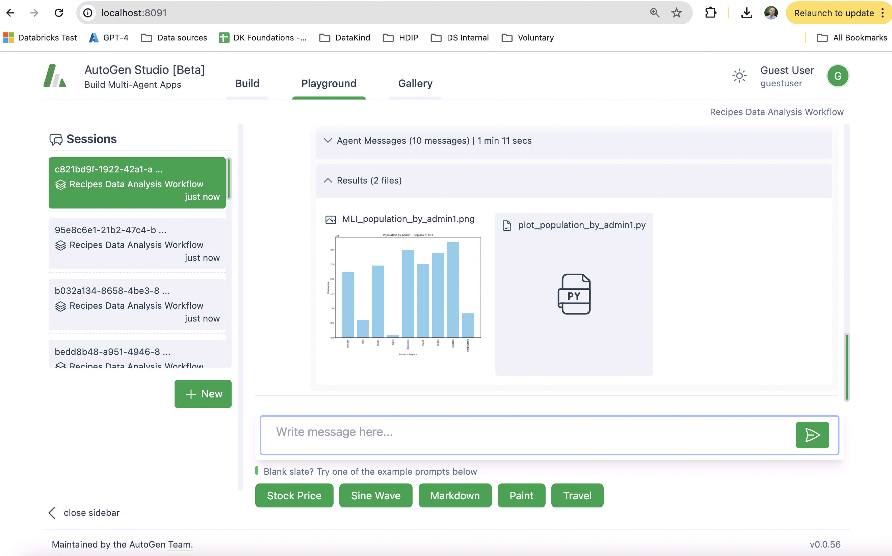

# Autogen Studio and autogen agent teams for creating data recipes

:warning: This README is temporary, info will be migrated to the main README later.

This folder contains an autogenstudio instance for the Docker build, as well as sample skill, agent and workflows to use a team of autogen agents for creating data recipes.

You can information on Autogen studio [here](https://github.com/microsoft/autogen/tree/main/samples/apps/autogen-studio). This folder includes a skill to query the data recipes data DB, an agent to use that, with some prompts to help it, and a workflow that uses the agent.

To activate:

1. Edit `../docker-compose.yml` and uncomment section for `recipe-creation` service
2. `docker compose up -d --build`
3. Run the data ingestion if you haven't already (see `../README.md`)
3. Go to [http://localhost:8091/](http://localhost:8091/)
4. Click on 'Build'
5. Click 'Skills' on left, top right click '...' and import the skill in `./assets`
6. Click 'Agents' on left, top right click '...' and import the skill in `./assets`
7. Click 'Workflows' on left, top right click '...' and import the skill in `./assets`
8. Go to playground and start a new session, select the 'Recipes data Analysis' workflow
9. Ask 'What is the total population of Mali?'